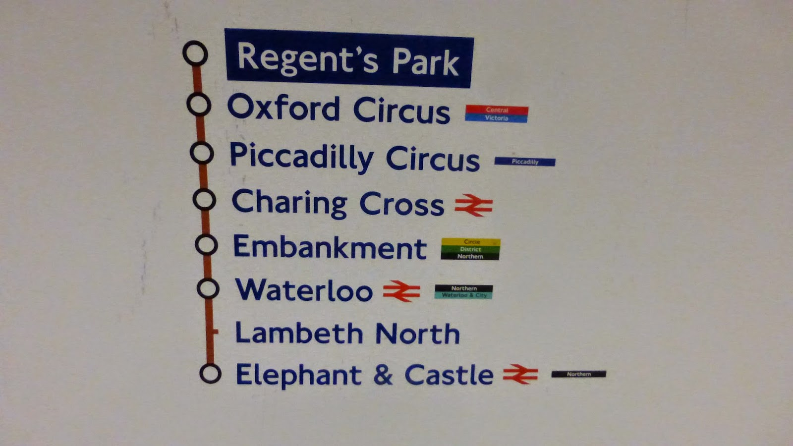

# Looping - While Loops
Computers can be programmed to continue repeating code ***while*** a condition has not been met.

<table>
<tbody>
<tr>
<td>
 
<!-- https://62andthenext10pathways.blogspot.com/2015/02/bakerloo-line-regents-park.html -->
<!--  -->
</td>

<td> 

```python
stop = int(input("What stop are we at?"))
while age != "Waterloo":
    print("This isn't our stop.")
    stop = int(input("What stop are we at?"))
```

</td>
<td>

As you can see in the example on the left, the code will keeping iterating and asking the same question ***while*** the answer is not *Batman*.

Notice the nesting of statements underneath the while? It is the indented code that will keep looping.

</td>
</tr>
</tbody>
</table>
