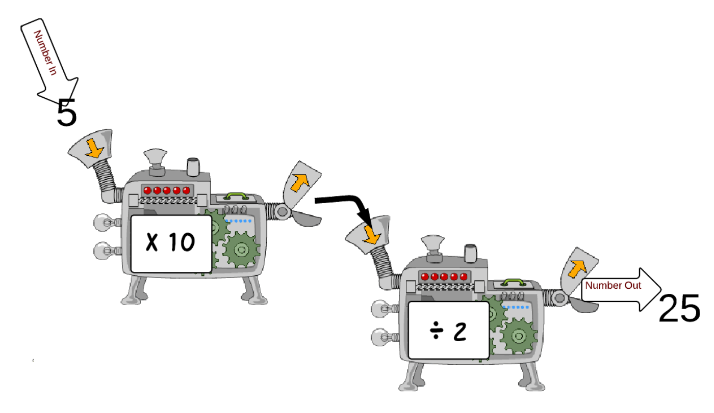

# Defining a function - Task 1
When writing code sometimes we need to repeat code several times and therefore end up writing the same thing repeatedly. To cut down on this most programming languages allow you to create functions that allow you to call the function that performs an action when you need it.

<table>
<tbody>
<tr>
<td>
 
<!-- The boys need to redraw this -->
</td>
<td>

To give you a basic idea we shall create a number machine that will receive a number and perform an action to it.

As you can see from the illustration on the left, the number `5` is given to the machine as an *argument*.

It is then multiplied by `5` and divided by `2`.

</td>
</tr>
</tbody>
</table>

The code for such a function could look like this:
<table>
<tbody>
<tr>
<td>

```python
def numberMachine(x):
    x = x * 10 / 2
    print(x)

numberMachine(5)
```

</td>
<td>

Here the name of the function is defined. x will be replaced with a number. 
Underneath the name of the function the calculation is added.

Wherever the name of the function is written on a page of code, it will *'call upon'* it and execute it. This can be called *calling* the function.

</td>
</tr>
</tbody>
</table>

Task
<table>
<tbody>
<tr>
<td>
1. Write a number machine function to take a number and multiply it by the power of 3 & divide it by 3. (***easy***)
</td>
<td>
2. Write a function to take the radius of a circle and work out the area. (***hard***, refer to variables task 3)
</td>
</tr>
<tr>
<td>

```python
def numberMachine(x):
    x = x * x * x / 3
    print(x)

numberMachine(x)
```

</td>
<td>

```python
def numberMachine(x):
    pi = 3.14
    y = pi * x * x
    print(y)

numberMachine(x)
```
</td>
</tr>
</tbody>
</table>


def numberMachine(x):
    x = x * x * x / 3
    print(x)

numberMachine(x)
def numberMachine(x):
    pi = 3.14
    y = pi * x * x
    print(y)

numberMachine(x)


